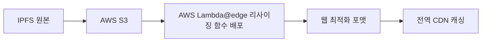

# NFT Sea 🌐⛓️

Web3 기술을 활용한 탈중앙화 NFT 마켓플레이스

🔗 **라이브 데모**: [https://dztwi6z9vov5x.cloudfront.net/](https://dztwi6z9vov5x.cloudfront.net/)

## 📸 스크린샷

<div align="center">


*NFT Sea 홈페이지*


*NFT 마켓플레이스*


*NFT 상세 페이지*


*사용자 프로필*

</div>

## 🚀 기술 스택

### 🎨 프론트엔드
| 기술 | 용도 |
|------|------|
| **React** + TypeScript | UI 프레임워크 |
| **Vite** | 빌드 도구 |
| **Web3.js** | 블록체인 연동 |
| **Recharts** | 데이터 시각화 |
| **React Router** | 페이지 라우팅 |
| **Swiper** | 이미지 캐러셀 |

### ⛓️ 백엔드 & 블록체인
| 기술 | 용도 |
|------|------|
| **Solidity** | 스마트 컨트랙트 개발 |
| **IPFS** (Pinata) | 메타데이터 저장 |
| **AWS Lambda@edge** | 이미지 리사이징 및 CDN |

### 🌐 배포
| 서비스 | 용도 |
|--------|------|
| **AWS S3** | 정적 파일 호스팅 |
| **CloudFront** | CDN 및 배포 |


## ⚡ 빠른 시작

### 📋 필수 요구사항
-  
- 
- 이더리움 테스트넷 토큰

### 🔧 설치 및 실행

1. **저장소 클론**
```bash
git clone [저장소-URL]
cd nft-sea
```

2. **의존성 설치**
```bash
npm install
npm install @svgr/rollup  # Vite용 SVG 설정
```

3. **개발 서버 실행**
```bash
npm run dev
```

### ⚙️ Vite SVG 설정

**1단계:** `vite.config.ts`에 추가
```typescript
import svgr from "@svgr/rollup";

export default defineConfig({
  plugins: [react(), svgr()],
});
```

**2단계:** `types.d.ts` 파일 생성
```typescript
declare module "*.svg" {
  import React = require("react");
  export const ReactComponent: React.FC<React.SVGProps<SVGSVGElement>>;
  const src: string;
  export default src;
}
```

**3단계:** `tsconfig.json`에 추가
```json
{
  "include": ["src", "types.d.ts"]
}
```

**사용 예시:**
```typescript
import { ReactComponent as IconEther } from './assets/ether.svg';
```

## 🏗️ 주요 기능

<details>
<summary><strong>🎨 NFT 마켓플레이스</strong></summary>

- ✅ NFT 민팅 및 생성
- ✅ NFT 구매 및 판매  
- ✅ 가격 히스토리 추적
- ✅ 카테고리별 필터링
- ✅ 검색 및 페이지네이션

</details>

<details>
<summary><strong>👤 사용자 기능</strong></summary>

- ✅ 지갑 연결 (MetaMask)
- ✅ 개인 NFT 컬렉션 관리
- ✅ 거래 내역 조회
- ✅ 프로필 커스터마이징

</details>

## 🛠️ 개발 중 주요 결정사항

### 💾 데이터 저장 전략: 스마트 컨트랙트 vs IPFS

> **결론: 스마트 컨트랙트 중심 + IPFS 보조**

| 항목 | 스마트 컨트랙트 | IPFS |
|------|---------------|------|
| **장점** | ✅ 데이터 무결성<br>✅ 탈중앙화 원칙<br>✅ 거래 신뢰성 | ✅ 메타데이터 수정 가능<br>✅ 빠른 조회<br>✅ 가스비 절약 |
| **단점** | ❌ 높은 가스비<br>❌ 느린 속도 | ❌ 보안 우려<br>❌ 중앙집권화 |
| **활용** | 핵심 거래 로직 | 이미지 & 메타데이터 저장 |

### 🖼️ 이미지 최적화: AWS Lambda@edge 도입

**문제점:**
- IPFS 이미지 로딩 속도 지연
- 원본 크기 이미지로 인한 성능 저하

**해결책:**


**결과:**
- 🚀 로딩 속도 개선
- 📱 엣지 컴퓨팅 리소스로 리사이징
- 🌍 글로벌 CDN 활용

## 🔧 개발 팁 및 해결책

### 1️⃣ Vite SVG 가져오기 이슈

> **문제:** CRA와 달리 Vite에서는 SVG를 React 컴포넌트로 가져오기 위해 추가 설정 필요

```typescript
// ❌ 잘못된 방법 (CRA 방식)
import { ReactComponent as IconEther } from './assets/ether.svg';

// ✅ 올바른 방법 (Vite + 설정 후)
import { ReactComponent as IconEther } from './assets/ether.svg';
// 위 설정 섹션 참조
```

### 2️⃣ React-Swiper Thumbs 타입 에러

> **문제:** `Cannot convert undefined or null to object` 에러 발생

```typescript
// ❌ 문제가 있는 코드
<Swiper thumbs={{swiper: thumbsSwiper}}>

// ✅ 해결 방법
<Swiper 
  thumbs={{
    swiper: thumbsSwiper && !thumbsSwiper.destroyed ? thumbsSwiper : null
  }}
>
```

### 3️⃣ React Router v6 스크롤 복원

> **문제:** 페이지 이동 시 스크롤 위치 복원

```typescript
// ❌ 기존 방법 (복잡한 커스텀 훅)
const ScrollToTop = () => {
  const { pathname } = useLocation();
  useEffect(() => {
    if (pathname === '/') return;
    window.scrollTo(0, 0);
  }, [pathname]);
  return null;
}

// ✅ 개선된 방법 (React Router v6)
import { ScrollRestoration } from "react-router-dom";

// App.tsx에서 사용
<ScrollRestoration />
```

### 4️⃣ addEventListener 의존성 배열 이슈

> **문제:** 이벤트 리스너 내에서 상태값이 초기값만 참조

```typescript
// ❌ 문제가 있는 코드
useEffect(() => {
  const handleScroll = (e) => {
    // lastScrollTop이 항상 초기값만 참조
    console.log(lastScrollTop);
  };
  window.addEventListener('scroll', handleScroll);
}, []); // 빈 의존성 배열

// ✅ 해결 방법
useEffect(() => {
  const handleScroll = (e) => {
    // 최신 lastScrollTop 값 참조 가능
    console.log(lastScrollTop);
  };
  window.addEventListener('scroll', handleScroll);
  
  return () => {
    window.removeEventListener('scroll', handleScroll);
  };
}, [lastScrollTop]); // 의존성 배열에 상태 추가
```

### 5️⃣ URI 인코딩 주의사항

> **문제:** Pinata API 쿼리 파라미터 전달 시 인코딩 이슈

```typescript
// ❌ 잘못된 방법
const url = `api/search?category=${category}`;

// ✅ 올바른 방법
const encodedCategory = encodeURIComponent(`%${category}%`);
const url = `api/search?metadata[keyvalues]={"tags":{"value":"${encodedCategory}","op":"like"}}`;
```

**인코딩 참고사항:**
- `encodeURIComponent()`: URL 일부만 인코딩 (권장)
- 공백 → `%20`, `/` → `%2F`, `'` → `%27`

## 📚 학습 자료 및 레퍼런스

### 🎓 Solidity & 블록체인 개발

| 카테고리 | 자료 | 설명 |
|---------|------|------|
| **기초 강의** | [인프런 - 블록체인 프로그래밍](https://www.inflearn.com/course/%EB%B8%94%EB%A1%9D%EC%B2%B4%EC%9D%B8-%ED%94%84%EB%A1%9C%EA%B7%B8%EB%9E%98%EB%B0%8D-%EC%BD%94%EC%9D%B8%EC%A0%9C%EC%9E%91) | 대니월드의 솔리디티 기초 |
| **실습 예제** | [Solidity by Example](https://solidity-by-example.org/) | 실전 예제 모음 |
| **공식 문서** | [Solidity Documentation](https://docs.soliditylang.org/) | 솔리디티 공식 문서 |

### 🌐 Web3 & 도구

| 카테고리 | 자료 | 설명 |
|---------|------|------|
| **IPFS** | [Pinata 공식 문서](https://docs.pinata.cloud/) | IPFS 파일 관리 서비스 |
| **라우팅** | [React Router v6](https://reactrouter.com/) | SPA 라우팅 라이브러리 |
| **차트** | [Recharts 문서](https://recharts.org/) | React 차트 라이브러리 |

### 💡 주요 학습 포인트

<details>
<summary><strong>📖 Solidity 핵심 개념</strong></summary>

1. **데이터 타입 및 변수**
   - 상태변수 vs 지역변수 vs 전역변수
   - `constant`와 `immutable` 차이점

2. **함수 및 제어자**
   - `view`, `pure` 함수 차이점
   - `modifier` 활용한 접근 제어
   - 에러 처리: `require`, `revert`, `assert`

3. **고급 기능**
   - `mapping`과 배열 활용
   - 구조체(`struct`)와 열거형(`enum`)
   - 상속과 인터페이스

4. **이더 전송**
   - `transfer`, `send`, `call` 차이점
   - `payable` 함수와 이더 수신

</details>

<details>
<summary><strong>🔗 Web3 연동 핵심</strong></summary>

1. **지갑 연결**
   - MetaMask와의 연동
   - 계정 변경 및 네트워크 감지

2. **스마트 컨트랙트 상호작용**
   - 컨트랙트 인스턴스 생성
   - 트랜잭션 전송 및 이벤트 감지

3. **IPFS 활용**
   - 파일 업로드 및 메타데이터 관리
   - Pinata API 활용

</details>

## 🚨 알려진 이슈 및 해결책

<details>
<summary><strong>🌐 CloudFront 배포 시 SPA 라우팅 문제</strong></summary>

**문제:** SPA 특정 경로에서 새로고침 시 403 에러 발생

```xml
<Error>
  <Code>AccessDenied</Code>
  <Message>Access Denied</Message>
</Error>
```

**원인:**
- S3 접근 권한이 CloudFront로 제한됨
- `/route` 경로에서 직접 새로고림 시 S3가 해당 파일을 찾지 못함

**해결 방법:**
1. **CloudFront 에러 페이지 설정**
   ```
   HTTP 에러 코드: 403
   에러 캐싱 최소 TTL: 0
   사용자 지정 에러 응답: 예
   응답 페이지 경로: /index.html
   HTTP 응답 코드: 200
   ```

2. **S3 버킷 권한 설정**
   - 모든 URL 패턴(`/*`)에 대한 접근 허용 추가

</details>

<details>
<summary><strong>⏱️ 비동기 함수와 Alert 타이밍 이슈</strong></summary>

**문제:** 비동기 함수 완료 후 실행되어야 할 `alert`가 먼저 실행됨

```javascript
// ❌ 문제가 있는 코드
async function handleSubmit() {
  const result = await submitData();
  alert('완료되었습니다'); // 예상과 다른 시점에 실행
}
```

**원인:**
- JavaScript 이벤트 루프와 Promise 실행 순서
- `alert`가 JavaScript 실행을 일시 중지시키는 특성

**해결책:**
```javascript
// ✅ SweetAlert 사용
import Swal from 'sweetalert2';

async function handleSubmit() {
  const result = await submitData();
  Swal.fire('성공!', '완료되었습니다', 'success');
}

// ✅ Toast 메시지 사용 (권장)
import { toast } from 'react-toastify';

async function handleSubmit() {
  const result = await submitData();
  toast.success('완료되었습니다');
}
```

</details>

<details>
<summary><strong>📊 Recharts Width Warning</strong></summary>

**문제:** 모바일 반응형으로 width를 동적 설정 시 warning 발생

```typescript
// ⚠️ Warning 발생
<LineChart
  width={mobileSize ? 300 : 600}
  height={200}
  data={data}
/>
```

**현재 상태:**
- GitHub Issue에서 논의 중: [recharts/recharts#3615](https://github.com/recharts/recharts/issues/3615)
- 임시 해결책: Warning 무시하고 사용 (기능상 문제 없음)

</details>


<div align="center">
